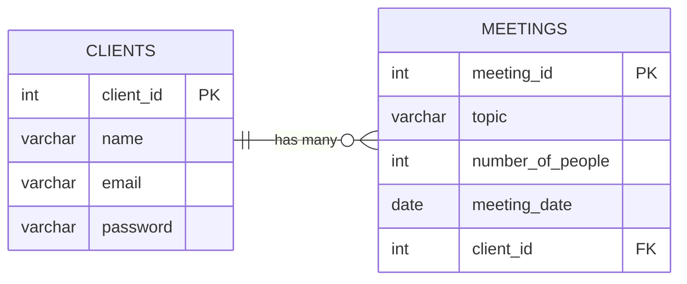

# clientDB

The following project I am providing screenshots to showcase the use of MySQL to structure, query, and manage data efficiently while maintaining strong data integrity and security.

This included applying relational database design principles and creating an ER model to define clear relationships between entities.

I also performed full CRUD operations and used SQL JOINs and complex queries to extract meaningful insights and relationships across multiple data sets.

## Commands used for clientDB database and tables creation

```
-- Create a new database
CREATE DATABASE clientDB;
```

### Clients table creation

```
-- Create the clients table
CREATE TABLE clients (
    client_id INT AUTO_INCREMENT PRIMARY KEY,
    name VARCHAR(100) NOT NULL,
    email VARCHAR(150) UNIQUE NOT NULL,
    password VARCHAR(255) NOT NULL
);

-- Insert the clents to table
INSERT INTO clients (name, email, password)
VALUES
('Anna Roberts', 'anna.roberts@example.com', 'hashed_password_1'),
('Michael Chen', 'michael.chen@example.com', 'hashed_password_2'),
('Sophia Martinez', 'sophia.martinez@example.com', 'hashed_password_3'),
('David Johnson', 'david.johnson@example.com', 'hashed_password_4');
```

### Meetings table creation (with foreign key)

```
-- Create the meetings table
CREATE TABLE meetings (
    meeting_id INT AUTO_INCREMENT PRIMARY KEY,
    topic VARCHAR(200) NOT NULL,
    number_of_people INT NOT NULL,
    meeting_date DATE NOT NULL,
    client_id INT NOT NULL,

    -- Set up foreign key relationship to clients table
    FOREIGN KEY (client_id) REFERENCES clients(client_id)
);

-- Insert the meetings to table
INSERT INTO meetings (topic, number_of_people, meeting_date, client_id)
VALUES
('Initial project consultation', 3, '2025-02-10', 1),
('Blueprint review session', 2, '2025-02-15', 1),
('Budget planning discussion', 4, '2025-02-20', 2),
('Interior design preferences', 2, '2025-02-22', 3),
('Final approval meeting', 5, '2025-03-01', 4);
```

### Join query to verify everything is linked

```
-- join
SELECT
    meetings.meeting_id,
    meetings.topic,
    meetings.number_of_people,
    meetings.meeting_date,
    clients.name AS client_name
FROM meetings
JOIN clients ON meetings.client_id = clients.client_id;
```

### ER Diagram Model


