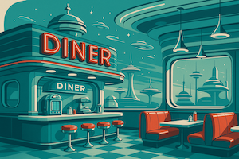
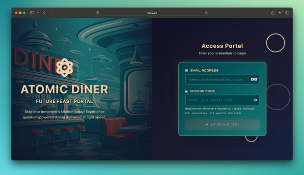

# Atomic Diner - Online Food Ordering Application 🛸🍔

<div align="left">
  
  <p><em>Atomic Diner</em></p>
</div>

## 🍔 Overview

Atomic Diner is a modern, responsive online food ordering application that allows users to browse menus, add items to cart, and place orders seamlessly. Built with HTML5, CSS3, JavaScript ES6+, and TailwindCSS, this application demonstrates best practices in frontend development.

## ✨ Features

### Core Functionality

-   **Responsive Design**: Works perfectly on desktop, tablet, and mobile devices
-   **Interactive Menu**: Browse categorized food items with search functionality
-   **Shopping Cart**: Add, remove, and modify items with real-time updates
-   **Order Management**: Streamlined checkout process
-   **Contact Form**: Customer inquiry and feedback system

### Technical Features

-   **AJAX Integration**: Dynamic loading of menu items without page refresh
-   **Local Storage**: Cart persistence across browser sessions
-   **Smooth Animations**: Enhanced user experience with CSS transitions
-   **Accessibility**: WCAG compliant with proper ARIA labels
-   **SEO Optimized**: Semantic HTML structure and meta tags

<div align="center">
  
  <p>Login Screen</p>
</div>

## 🚀 Getting Started

### Prerequisites

-   Node.js (v14.16.0 or higher)
-   Local web server (optional but recommended)

### Installation

1. **Clone the repository**

    ```bash
    git clone https://github.com/your-username/sl-fsd-project1.git
    cd sl-fsd-project1
    ```

2. **Install dependencies (optional)**

    ```bash
    npm install
    ```

3. **Run the application**

    **Option A: Using npm (recommended)**

    ```bash
    npm start
    ```

4. **Open your browser**
   Navigate to `http://localhost:3000`

    ```
    After running npm start, you can directly access the main app by navigating to http://localhost:3000/index.html.

    You do not need to log in via login.html, simply open index.html to use the application.
    ```

## 🎯 Core Features Explained

### 1. Shopping Cart

-   **Add to Cart**: One-click adding with visual confirmation
-   **Quantity Management**: Increment/decrement quantities inline
-   **Persistence**: Cart contents saved in localStorage
-   **Real-time Updates**: Live total calculation and item count

### 2. User Interface

-   **Responsive Navigation**: Collapsible mobile menu
-   **Modal System**: Cart overlay with smooth animations
-   **Toast Notifications**: User feedback for actions
-   **Loading States**: Spinner during data loading

### 3. Form Handling

-   **Contact Form**: Validation and submission handling
-   **Error Management**: User-friendly error messages
-   **Success Feedback**: Confirmation notifications

## 🛠️ Technologies Used

### Frontend

-   **HTML5**: Semantic markup and accessibility
-   **CSS3**: Modern styling with Flexbox and Grid
-   **JavaScript ES6+**: Modern JavaScript features
-   **TailwindCSS**: Utility-first CSS framework

### External Libraries

-   **Font Awesome**: Icon library
-   **Google Fonts**: Typography (Inter font family)

## 🙏 Acknowledgments

-   [Unsplash](https://unsplash.com) for food images
-   [TailwindCSS](https://tailwindcss.com) for CSS framework
-   [Font Awesome](https://fontawesome.com) for icons
-   [Google Fonts](https://fonts.google.com) for typography

## 📞 Contact

For questions or support, please contact:

-   Email: a.a.zepeda003[@]gmail.com
-   GitHub: [@code-qtzl](https://github.com/code-qtzl)

---

**Made by Andres Zepeda**
